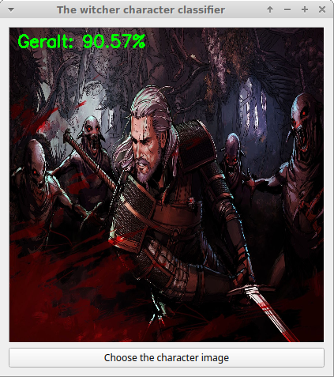
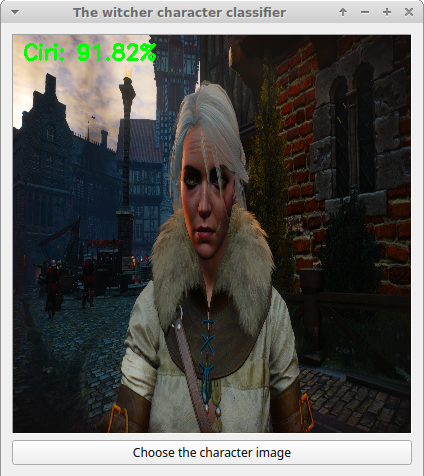

# Witcher character classifier

Convolutional Neural Network (CNN) analyzing pictures of characters from "The Witcher 3" video game in order to establish a classification.

## Description

This is my first personal deep learning project after completing the courses by professor Andrew Ng on Coursera.

Being a fan of the witcher books and games series, I thought it could be fun :).

The project was made with the deep learning framework Keras and can recognize up to 12 different characters:

   

Feel free to leave remarks on how to improve the model even more.

## Installation

   * Install pip
   * create a virtual environment using python 3
   * run the command:
       ```
       pip install -r requirements.txt
       ```
You can find many guides on pip, python and virtualenv on the web.

## Preprocessing
  * Creating a dataset using [Microsoft’s Bing Image Search API](https://azure.microsoft.com/en-us/services/cognitive-services/bing-image-search-api/)
  * Resizing dataset to a size of 224x224
  * Data augmentation techniques:
    * Random rotation
    * Random noise
    * Horizontal flip
    * Random erasing
    
## Transfer learning

I used transfer learning with pre-trained weights from the VGG-16 model. This helped the model to learn better.

### Training process

The model was trained on 100 epochs. It uses the Adam optimizer for gradient descent.

```
Usage: python src/train_nn.py

  -m, --model              path to trained model model (default: output/witcher-classifier.h5)  
  -d, --dataset            path to input dataset (default: dataset)  
  -l, --labelbin           path to output label binarizer (default: lb.pickle)  
  -p, --plot               path to output accuracy/loss plot (default: output/plot.png)  
  --show_examples          show some training examples
```

## Model loss/accuracy

* Accuracy and Loss:

    
   
## User interface

A user interface made with pyqt to make the classification easier:

```
Usage: python src/run_nn.py

  -m, --model              path to trained model model (default: output/witcher-classifier.h5)  
  -l, --labelbin           path to output label binarizer (default: lb.pickle)  
```

## A few classification examples

The model generalizes with examples absent from the training set.

For Geralt (painting):

   
   
For Ciri (screenshot taken in-game by myself):

   

## Possible improvements
  * Using classification with object recognition to detect every characters in the image:
  
    
    
  * Using more training examples.
    
## Authors and acknowledgment
Many thanks to Adrian Rosebrock from pysearchimage for his series of articles:

* [How to (quickly) build a deep learning image dataset](https://www.pyimagesearch.com/2018/04/09/how-to-quickly-build-a-deep-learning-image-dataset/)
* [Keras and Convolutional Neural Networks (CNNs)](https://www.pyimagesearch.com/2018/04/16/keras-and-convolutional-neural-networks-cnns/)

## License
[MIT](https://choosealicense.com/licenses/mit/)
