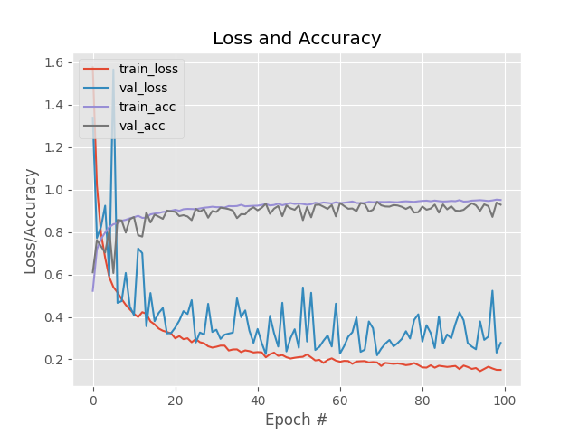

# Witcher character classifier
Convolutional Neural Network (CNN) analyzing the features of characters from the witcher 3.

## Preprocessing
  * Creating a dataset using [Microsoft’s Bing Image Search API](https://azure.microsoft.com/en-us/services/cognitive-services/bing-image-search-api/)
  * Resizing dataset to a size of 224x224
  * Data augmentation techniques:
    * Random rotation
    * Random noise
    * Horizontal flip
    * Random erasing
    
## Transfer learning

I used transfer learning with pre-trained weights from the VGG-16 model. This helped the model to learn better.

### Training process

The model was trained on 100 epochs. It uses the Adam optimizer for gradient descent.

## Model loss/accuracy

* Accuracy and Loss:

    

## Possible improvements
  * Using classification with object recognition to detect every characters in the image:
  
    
    
## Authors and acknowledgment
Many thanks to Adrian Rosebrock from pysearchimage for his series of articles:

* [How to (quickly) build a deep learning image dataset](https://www.pyimagesearch.com/2018/04/09/how-to-quickly-build-a-deep-learning-image-dataset/)
* [Keras and Convolutional Neural Networks (CNNs)](https://www.pyimagesearch.com/2018/04/16/keras-and-convolutional-neural-networks-cnns/)

## License
[MIT](https://choosealicense.com/licenses/mit/)
